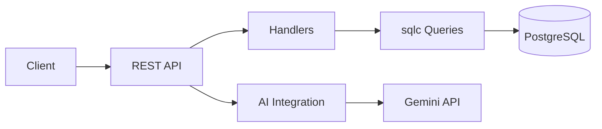
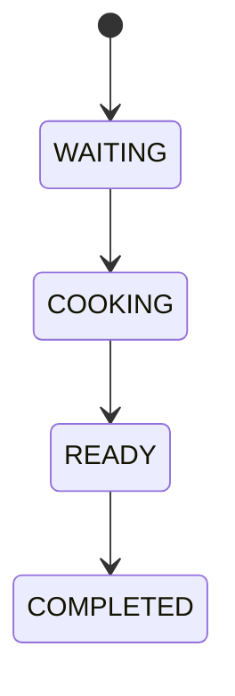
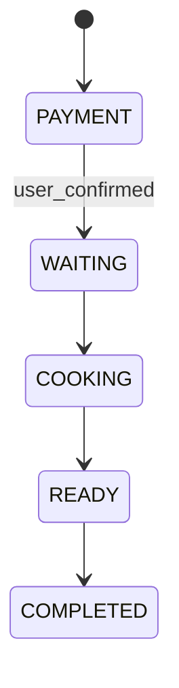
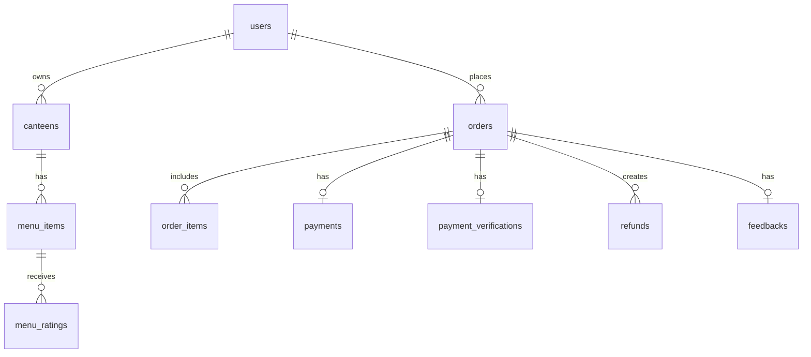

# BCC Canteen

BCC Canteen is a role-based digital canteen ordering backend that supports user ordering, payment management, owner operations, and admin oversight, with read-only AI insights for feedback analysis.

## 1. Project Title and Overview

**Problem statement:** traditional canteen ordering is fragmented and lacks real-time visibility for customers and owners.

**System goals:**

- Digital canteen ordering
- Payment management
- Role-based management
- AI insights support

## 2. Key Features

### User Features

- Account registration
- Login & profile management
- Browse canteens and menus
- Order placement with stock validation
- Cash & Cashless QRIS payment
- Order tracking
- Feedback submission
- AI recommendation explanation

### Canteen Owner Features

- Menu CRUD with stock management
- Incoming order dashboard
- Payment verification for QRIS
- Order workflow control
- Feedback moderation
- AI feedback insights

### Admin Features

- Owner account lifecycle management
- User account moderation
- QRIS configuration per canteen
- AI oversight analytics

## 3. Technology Stack

- **Go**: fast, static, production-friendly runtime.
- **Gin**: lightweight HTTP routing and middleware.
- **PostgreSQL**: relational storage with strong consistency.
- **sqlc**: type-safe SQL access and compile-time validation.
- **JWT Authentication**: stateless auth with role claims.
- **Gemini AI Integration**: read-only insights and summaries.
- **REST API Architecture**: simple, interoperable HTTP surface.

## 4. System Architecture

### High-Level Architecture Description

- **Handler layer**: Gin handlers enforce RBAC and validation.
- **Business logic**: implemented directly in handlers to keep flow explicit and transactional.
- **Repository layer**: sqlc-generated queries provide typed DB access.
- **Database layer**: PostgreSQL enforces constraints and consistency.
- **AI integration**: Gemini client generates structured insights from aggregated data.

### Architecture Diagram



## 5. Role-Based Access Control

- **USER**: can order, pay, and provide feedback.
- **OWNER**: manages menus and order workflow for owned canteens.
- **ADMIN**: manages owners, accounts, and system-wide settings.
- **Ownership rule**: OWNER endpoints are scoped to canteens they own; ADMIN bypasses ownership checks.

## 6. Order Lifecycle

### CASH Order Flow

WAITING → COOKING → READY → COMPLETED



### CASHLESS QRIS Order Flow

PAYMENT → WAITING → COOKING → READY → COMPLETED

Verification flow:
- User confirms payment: payment_status becomes AWAITING_VERIFICATION
- Owner approves: payment_status becomes PAID
- Owner rejects: payment_status becomes REJECTED and refund record created



## 7. Payment System Design

- **Static QRIS per canteen**: admin configures a QRIS URL per canteen.
- **Manual verification**: owner approves or rejects QRIS confirmations.
- **Refund record**: rejection creates a refund record for tracking.
- **Idempotency handling**: duplicate confirmations are rejected.
- **Payment status management**: UNPAID → AWAITING_VERIFICATION → PAID or REJECTED.

## 8. AI Features

### AI Feedback Analyzer

- Sentiment detection
- Complaint clustering
- Action recommendations

### AI Recommendation Explanation

- Explains why a canteen or menu item is recommended

### AI Oversight Analytics

- Admin watchlist signals for risk trends

Privacy guarantees:

- Aggregated data only
- No PII exposure
- Read-only AI usage

## 9. Database Design Overview

Key entities:

- users, canteens, menu_items
- orders, order_items
- payments, payment_verifications, refunds
- feedbacks, menu_ratings

Transaction safety:

- Order creation and stock updates are atomic.
- Feedback and menu ratings are recorded in a single transaction.

Stock locking:

- menu_items rows are locked during order creation to prevent oversell.

ER diagram:



## 10. API Documentation

- OpenAPI: docs/openapi.yaml
- Apidog: https://wh1ozyp0kd.apidog.io
- Import into Swagger UI, Postman, or Apidog.
- Authentication: Authorization: Bearer <token>

## 11. Installation Guide

### Requirements

- Go 1.22+
- PostgreSQL 15+
- Git

### Step-by-Step Setup

1. Clone the repository

```bash
git clone <repo-url>
cd freepass-2026
```

2. Set environment variables

```bash
cp .env.example .env
```

3. Apply migrations

```bash
psql "$env:DATABASE_URL" -f migrations/000001_init.sql
psql "$env:DATABASE_URL" -f migrations/000002_improvements.sql
psql "$env:DATABASE_URL" -f migrations/000002_menu_ratings.sql
```

4. Generate sqlc code

```bash
sqlc generate
```

5. Run the server

```bash
go run ./cmd/api
```

6. Test the health endpoint

```bash
curl http://localhost:8080/health
```

## 12. Environment Variables

- **DATABASE_URL**: PostgreSQL connection string.
- **JWT_SECRET**: JWT signing secret.
- **APP_PORT**: HTTP server port.
- **GEMINI_API_KEY**: Gemini API key for AI features.
- **GEMINI_MODEL**: Gemini model name (default: gemini-2.5-flash).
- **AI_TIMEOUT_SECONDS**: AI request timeout in seconds.
- **SERVER_PORT**: Not used by current implementation; use APP_PORT.

## 13. Development Workflow

- Use feature branches and pull requests.
- Follow repository conventions in CONVENTION.md.
- Run tests before merging.

## 14. Testing Guide

### Unit tests

```bash
go test ./...
```

### API testing (PowerShell)

Register

```powershell
Invoke-RestMethod -Method Post -Uri "http://localhost:8080/auth/register" -ContentType "application/json" -Body '{"name":"Admin","email":"admin@example.com","password":"password123"}'
```

Login

```powershell
Invoke-RestMethod -Method Post -Uri "http://localhost:8080/auth/login" -ContentType "application/json" -Body '{"email":"admin@example.com","password":"password123"}'
```

AI examples

```powershell
Invoke-RestMethod -Method Get -Uri "http://localhost:8080/canteens/$env:CANTEEN_ID/ai/recommendation-explain?days=30" -Headers @{Authorization="Bearer $env:TOKEN"}
```

## 15. Error Handling Strategy

Standard error response:

```json
{ "message": "validation_error", "details": { "field": "invalid" } }
```

HTTP mapping:

- 400 validation_error
- 401 unauthorized
- 403 forbidden
- 404 not_found
- 409 conflict
- 500 internal_error
- 502 ai_invalid_response
- 503 ai_not_configured

## 16. Security Considerations

- JWT authentication for protected routes.
- RBAC enforced at handler layer.
- Ownership checks for OWNER endpoints.
- Secrets are never hardcoded in source.
- AI endpoints are read-only and do not expose PII.

## 17. Performance and Scalability Notes

- Indexed queries for frequent access patterns.
- Transactional stock updates for consistency.
- AI requests have timeouts and retries; keep them outside critical paths.
- No in-process cache is enabled by default.

## 18. Future Improvements

- Integrate real payment gateways.
- Add realtime order tracking.
- Introduce advanced AI forecasting.
- Provide mobile client support.

## 19. Contributing Guidelines Reference

See CONTRIBUTING.md.

## 20. Author Information

- Full Name: Aryan Zaky Prayogo
- Student ID (NIM): 255150207111059
- University: Universitas Brawijaya
- Major: Informatics

## Confirmation

Documentation matches current implementation.

